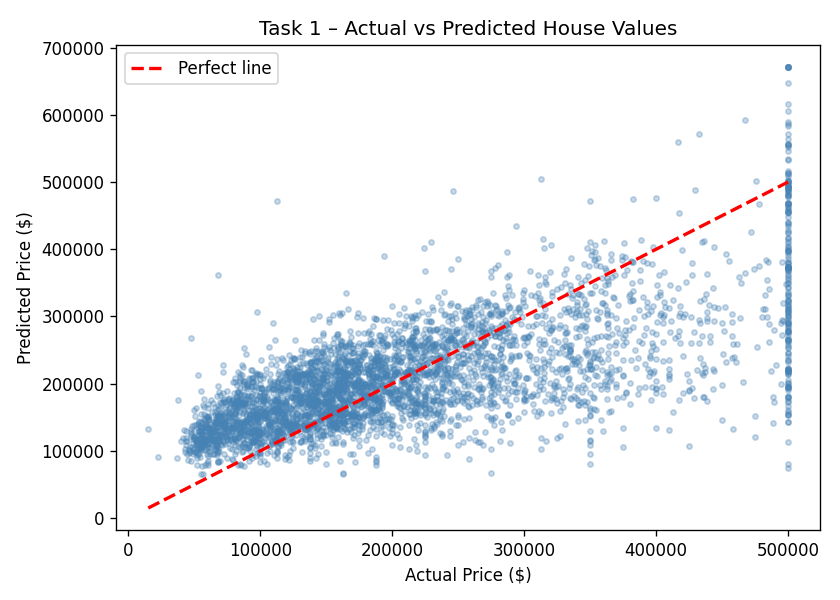
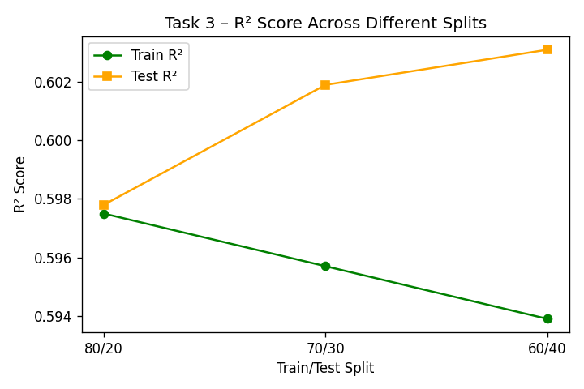

#  Linear Regression — Practical Tasks
**AI/ML Internship Program · Day 15**

> Build, compare, and evaluate Linear Regression models step by step using the California Housing dataset.

---

## Project Structure

```
 aiml-crash-Ashok_Kumar/
│
├──  Day1_Task/
├──  Day4_task/
├──  Day7_Task/
├──  Day9_Task/
├──  Day11_Task/
│
├──  Day15_Task/ 
│   ├── Linear Regression Task.ipynb                      
│   ├── housing.csv    
│   └── README.md                      
│
├──  Mini_Project_1/
├── .gitignore
└── README.md
```

---

## Dataset

| Detail        | Info |
|---------------|------|
| Name          | California Housing Prices |
| Source        | [Kaggle Link](https://www.kaggle.com/datasets/camnugent/california-housing-prices) |
| Rows          | 20,433 (after dropping nulls) |
| Target column | `median_house_value` |
| Features used | `median_income`, `housing_median_age`, `total_rooms`, `latitude`, `longitude`, `ocean_proximity` |

---

##  Task 1 — Baseline Linear Regression Model

### What I did
- Chose **1 feature** → `median_income`
- Target → `median_house_value`
- Split data **80% train / 20% test**
- Trained a `LinearRegression` model
- Calculated error metrics and plotted Actual vs Predicted

### Results

| Metric | Value |
|--------|-------|
| MSE    | 7,221,011,204 |
| RMSE   | $84,976.53 |
| MAE    | $63,374.55 |
| R²     | 0.4720 |

### Plot

### Key Learning
> R² = 0.47 means `median_income` alone explains ~47% of the price variation. A decent starting point for a single feature.

---

##  Task 2 — One Feature vs Multi-Feature Model

### What I did
- **Model A** → 1 feature: `median_income`
- **Model B** → 6 features: `median_income`, `housing_median_age`, `total_rooms`, `latitude`, `longitude`, `ocean_proximity`
- Compared both models using the same test set

### Results

| Metric | Model A (1 feature) | Model B (6 features) |
|--------|---------------------|----------------------|
| MSE    | 7,221,011,204       | 5,500,215,165        |
| RMSE   | $84,976.53          | $74,163.44           |
| MAE    | $63,374.55          | $54,741.57           |
| R²     | 0.4720              | **0.5978**         |

### Winner
**Model B** wins on every metric.
- R² improved by **+0.1258**
- RMSE dropped by **~$10,813**

### Key Learning
> More relevant features = better predictions. Location (latitude/longitude) and ocean proximity give the model important context it was missing before.

---

##  Task 3 — Testing Different Train/Test Splits

### What I did
- Used the 6-feature model (best from Task 2)
- Tested 3 different splits: **80/20**, **70/30**, **60/40**
- Recorded Train RMSE, Test RMSE, Train R², Test R², and the Gap between them

### Results

| Split | Train RMSE | Test RMSE | Train R² | Test R² | Gap (R²) |
|-------|-----------|-----------|----------|---------|----------|
| 80/20 | 73,631    | 74,163    | 0.6012   | 0.5978  | 0.0034   |
| 70/30 | 73,680    | 74,009    | 0.6009   | 0.5989  | 0.0020   |
| 60/40 | 73,761    | 73,890    | 0.6003   | 0.5995  | 0.0008   |

### Plot

### Best Split
**80/20** — Highest individual Test R² and gives the model the most training data.

### Key Learning
> The Gap (R²) is very small across all splits, which means the model is **stable** — it is not overfitting. All 3 splits give very similar test performance.

---

##  Task 4 — Metric Verification and Exploration

### What I did
- Took the best model (6 features, 80/20 split)
- Calculated MSE, RMSE, MAE, R² manually **without sklearn**
- Compared manual results vs sklearn results
- Added 2 extra metrics: Median Absolute Error, Explained Variance
- Added 3 large artificial errors to see which metric reacts the most

### Manual vs sklearn Verification

| Metric | sklearn    | Manual     | Match |
|--------|------------|------------|-------|
| MSE    | 5,500,215,165 | 5,500,215,165 | ✅ |
| RMSE   | 74,163.44  | 74,163.44  | ✅    |
| MAE    | 54,741.57  | 54,741.57  | ✅    |
| R²     | 0.5978     | 0.5978     | ✅    |

### Full Metrics Table

| Metric                | Value         |
|-----------------------|---------------|
| MSE                   | 5,500,215,165 |
| RMSE                  | $74,163.44    |
| MAE                   | $54,741.57    |
| R²                    | 0.5978        |
| Median Absolute Error | $41,211.00    |
| Explained Variance    | 0.5978        |

### Effect of 3 Large Artificial Errors

| Metric | Before        | After         | Change   |
|--------|---------------|---------------|----------|
| MSE    | 5,500,215,165 | 5,723,011,884 | +4.1%    |
| RMSE   | 74,163.44     | 75,650.92     | +2.0%    |
| MAE    | 54,741.57     | 55,317.23     | +1.0%    |

### Key Learning
> **MSE reacts the most** to large errors because it *squares* them, making big mistakes much more punishing.
> **MAE reacts the least** because it treats all errors equally regardless of size.
> Use MAE when your data has outliers. Use MSE/RMSE when large errors must be penalised heavily.

---

##  How to Run
```bash
### Step 1 — Clone the repo

git clone https://github.com/iamas-ok/aiml-crash-Ashok_Kumar.git
cd aiml-crash-Ashok_Kumar/Day15_Task


### Step 2 — Activate virtual environment

source .venv/bin/activate        # macOS / Linux
.venv\Scripts\activate           # Windows


### Step 3 — Install required libraries

pip install pandas numpy matplotlib scikit-learn jupyter


### Step 4 — Open the Notebook

jupyter notebook "Linear Regression Task.ipynb"
```
Then run each cell one by one with **Shift + Enter**.

---

##  Libraries Used

| Library      | Purpose                          |
|--------------|----------------------------------|
| `pandas`     | Load and clean the dataset       |
| `numpy`      | Manual metric calculations       |
| `matplotlib` | Plotting graphs                  |
| `sklearn`    | Train model, calculate metrics   |

---

##  Concepts Covered

- What is Linear Regression
- Splitting data into Train and Test sets
- How `model.fit()` and `model.predict()` work
- Error metrics: MSE, RMSE, MAE, R²
- Effect of adding more features
- Effect of changing train/test split size
- Manual vs sklearn metric verification
- How outliers affect different metrics

---

##  Author

**Ashok Kumar**
[github.com/iamas-ok/aiml-crash-Ashok_Kumar](https://github.com/iamas-ok/aiml-crash-Ashok_Kumar)
Submitted as part of **Day 15** practical tasks — AI/ML Internship Program.