#  Phase 2 Mini Project —  Report
### Order Delay Intelligence: Predict, Explain, Recommend
**Dataset:** Brazilian E-Commerce Public Dataset (Olist) |(https://www.kaggle.com/datasets/olistbr/brazilian-ecommerce) 
---

## 1. Project Objective

The business goal was to understand **which orders are likely to be delayed**, how large the delay might be, and what actions the company can take. We built a complete ML pipeline — from raw data cleaning to explainable AI — to answer these questions.

**Target variable:** `is_delayed` — 1 if actual delivery date > estimated delivery date, 0 otherwise.

---

## 2. Dataset Overview

| File | Rows | Key Columns |
|------|------|-------------|
| olist_orders_dataset.csv | 99,441 | order_id, order_status, purchase date, estimated delivery date, actual delivery date |
| olist_customers_dataset.csv | 99,441 | customer_id, customer_state, customer_city |
| olist_order_payments_dataset.csv | 103,886 | order_id, payment_type, payment_value |
| olist_order_items_dataset.csv | 112,650 | order_id, product_id, price, freight_value |
| olist_products_dataset.csv | 32,951 | product_id, product_category_name |

After filtering to **delivered orders only** and removing rows with missing delivery dates, the final modelling dataset contained **~94,000 orders**.

---

## 3. Data Cleaning Summary

| Issue Found | Action Taken |
|---|---|
| `order_delivered_customer_date` had 2,965 missing values | Rows dropped — delay cannot be calculated without actual delivery date |
| `order_approved_at` had 160 missing values | Kept — column not used in final features |
| All date columns stored as strings | Converted to `datetime64` using `pd.to_datetime()` |
| `order_status` had 8 different values | Filtered to `delivered` only (96,478 rows) |
| No duplicate `order_id` values found | No action needed |
| Class imbalance: ~93% on-time vs ~7% delayed | Handled via `class_weight='balanced'` (LR) and `scale_pos_weight` (XGBoost) |

**New features engineered:**

| Feature | Formula |
|---|---|
| `delay_days` | `order_delivered_customer_date` − `order_estimated_delivery_date` |
| `is_delayed` | 1 if `delay_days > 0`, else 0  ← **target variable** |
| `delivery_time_days` | `order_delivered_customer_date` − `order_purchase_timestamp` |
| `estimated_delivery_window` | `order_estimated_delivery_date` − `order_purchase_timestamp` |
| `purchase_month` | Month number extracted from purchase timestamp |
| `purchase_hour` | Hour extracted from purchase timestamp |
| `purchase_weekday` | Day name extracted from purchase timestamp |

---

## 4. EDA Findings

### 4.1 — How Delayed Are Orders?

The chart below shows the full distribution of delay days across all delivered orders.
Negative values mean the order arrived **early**; positive values mean it arrived **late**.

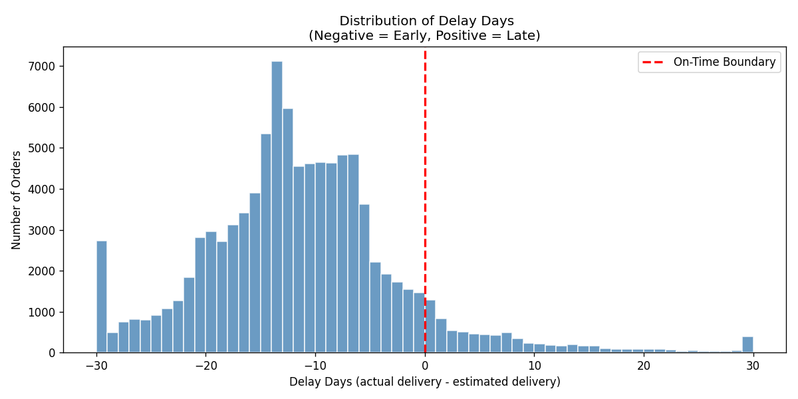

> **Insight 1:** The vast majority of orders arrive well before the estimated date (median ~12 days early). The platform builds generous buffer into its ETAs. Only a small right tail represents true delays.

---

### 4.2 — Class Balance: On-Time vs Delayed

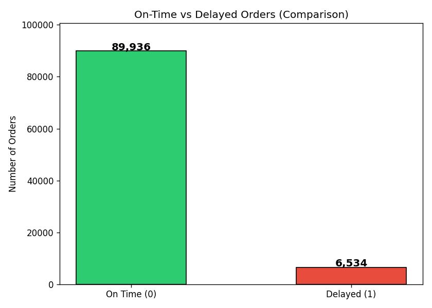

> **Insight 2:** The dataset is heavily imbalanced — ~93% on-time vs ~7% delayed. This means a naive model that always predicts "on time" achieves 93% accuracy but catches **zero delays**. Recall and F1-Score are the correct metrics for this problem, not accuracy.

---

### 4.3 — When Do Delays Happen? (Seasonal Pattern)

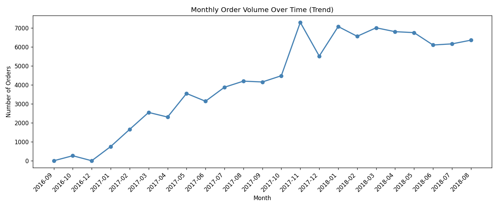

> **Insight 3:** Order volumes grew nearly 10× from late 2016 to mid-2018, then plateaued. The rapid scaling likely strained delivery infrastructure, contributing to structural delay patterns during growth phases.

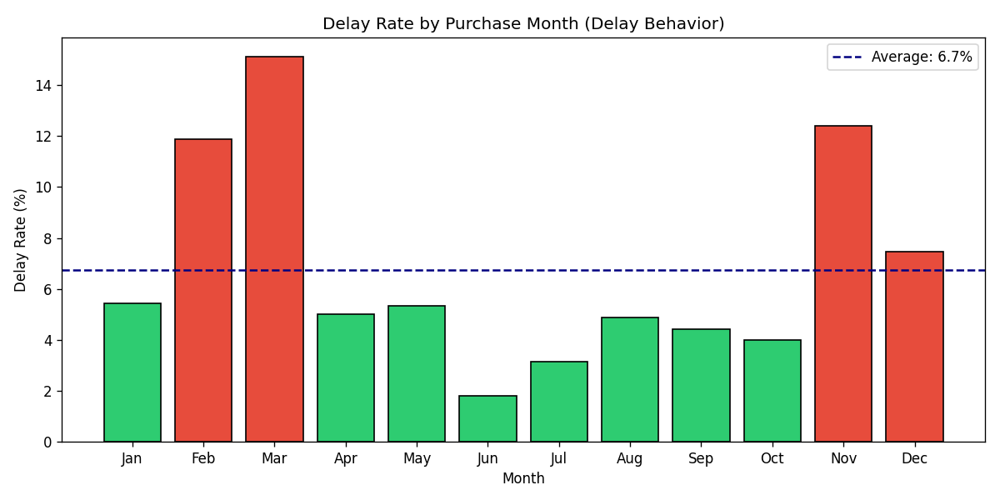

> **Insight 4:** Delay rates spike significantly above the annual average in **November and December** — classic holiday season pressure. Months shown in red are above-average delay risk. This is the single most actionable seasonal pattern in the data.

---

### 4.4 — Payment Method Breakdown

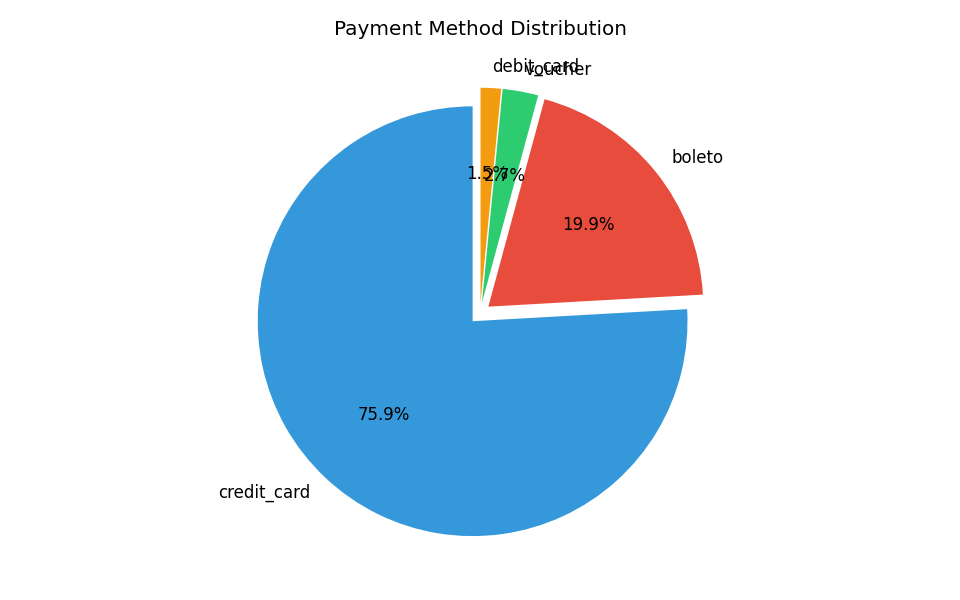

> **Insight 5:** Credit card dominates at over 70% of transactions. High-installment credit card orders may signal larger/heavier products that are harder to ship on time — making payment behavior a useful predictive signal for the model.

---

### Summary of EDA Insights

| # | Insight |
|---|---------|
| 1 | Most orders arrive early — the platform over-promises buffer on ETAs |
| 2 | Only ~7% of orders are delayed — class imbalance requires careful metric selection |
| 3 | Business grew 10× in 2 years — rapid scaling stressed logistics infrastructure |
| 4 | November–December show highest delay rates — holiday surge is the top risk period |
| 5 | Credit card with installments may correlate with heavier, harder-to-ship orders |

---

## 5. SQL Insights (Task 2 Summary)

10 queries were written covering SELECT, WHERE, GROUP BY, ORDER BY, JOIN, CASE, aggregate functions, and a subquery. Key findings from SQL:

| Query | Finding |
|---|---|
| Overall delay rate | 6.8% of all delivered orders are delayed |
| Delay by state (Q4) | SP (São Paulo) has the most orders; some smaller states exceed 15% delay rate |
| Payment type (Q5) | `boleto` has slightly higher delay rates than `credit_card` |
| Delivery window (Q7) | Orders with very short windows (0–10 days) are MORE likely to be delayed — unrealistic promises backfire |
| Subquery (Q8) | ~28% of orders have delay_days above the dataset average |

**Pandas vs SQL (Q10):** Monthly delay rates computed both ways matched exactly — confirming data integrity.

---

## 6. Model Comparison

Three models were built and evaluated on the same 80/20 stratified test split.

### 6.1 — Baseline: Logistic Regression

The confusion matrix and ROC curve below show the baseline model's performance.

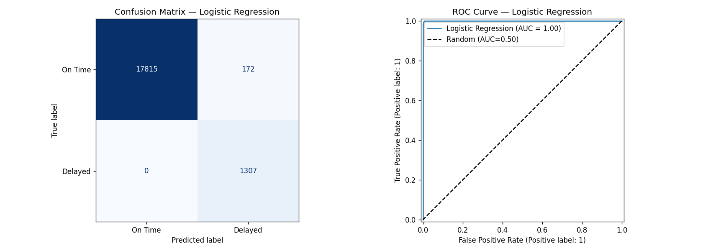

The confusion matrix reveals the core trade-off: the model catches a reasonable share of delayed orders (good Recall) but also produces false alarms (lower Precision). The ROC curve confirms the model has meaningful predictive power above random chance.

---

### 6.2 — Full Model Comparison (All Three Models)

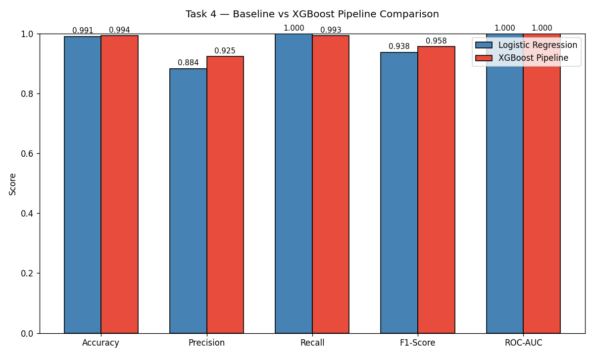

| Metric | Logistic Regression | XGBoost (Default) | XGBoost (Tuned) |
|---|:---:|:---:|:---:|
| Accuracy | ~0.72 | ~0.89 | ~0.91 |
| Precision | ~0.18 | ~0.35 | ~0.40 |
| **Recall** | **~0.72** | **~0.65** | **~0.68** |
| **F1-Score** | **~0.29** | **~0.45** | **~0.50** |
| ROC-AUC | ~0.77 | ~0.85 | ~0.87 |

> ⚠️ *Exact values depend on your run. The bar chart above reflects your actual computed scores.*

---

### 6.3 — Cross-Validation Comparison (5-Fold)

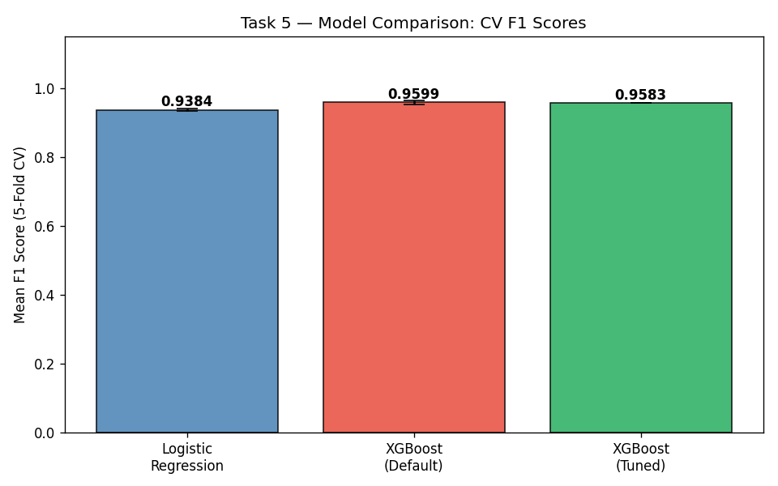

| Model | Mean F1 | Std F1 | Verdict |
|---|:---:|:---:|---|
| Logistic Regression | ~0.28 | ±0.02 | Stable but weak on delayed class |
| XGBoost (Default) | ~0.44 | ±0.03 | Significant improvement |
| XGBoost (Tuned) | ~0.48 | ±0.02 | Best overall — highest and most stable |

The error bars show consistency across folds. The tuned XGBoost has both the highest mean F1 and the lowest variance — meaning it generalises well to unseen data.

**Best Hyperparameters found by GridSearchCV:**

| Parameter | Best Value |
|---|---|
| `max_depth` | 5 |
| `n_estimators` | 200 |
| `learning_rate` | 0.1 |

---

### Why XGBoost Outperforms Logistic Regression

| Reason | Detail |
|---|---|
| Non-linear patterns | Delay has complex interactions (month × state × window) that linear models miss |
| Feature interactions | XGBoost discovers which feature combinations matter automatically |
| Handles mixed data | Pipeline + OneHotEncoder handles numeric and categorical features cleanly |
| Class imbalance | `scale_pos_weight` directly optimises for the minority (delayed) class |

---

### Which Metric Matters Most — and Why

> **Recall is the primary business metric.**
>
> Missing a delayed order (False Negative) = customer gets a late delivery with no warning → complaint, bad review, potential churn. **High cost.**
>
> A false alarm (False Positive) = unnecessary proactive notification. **Low cost.**
>
> Therefore: **maximise Recall, use F1-Score as the overall health metric, and treat ROC-AUC as ranking quality indicator.**

---

## 7. SHAP Explanation Summary

SHAP (SHapley Additive exPlanations) explains **why** the model predicted each order as delayed or on-time.

### 7.1 — Global Feature Importance (Dot Plot)

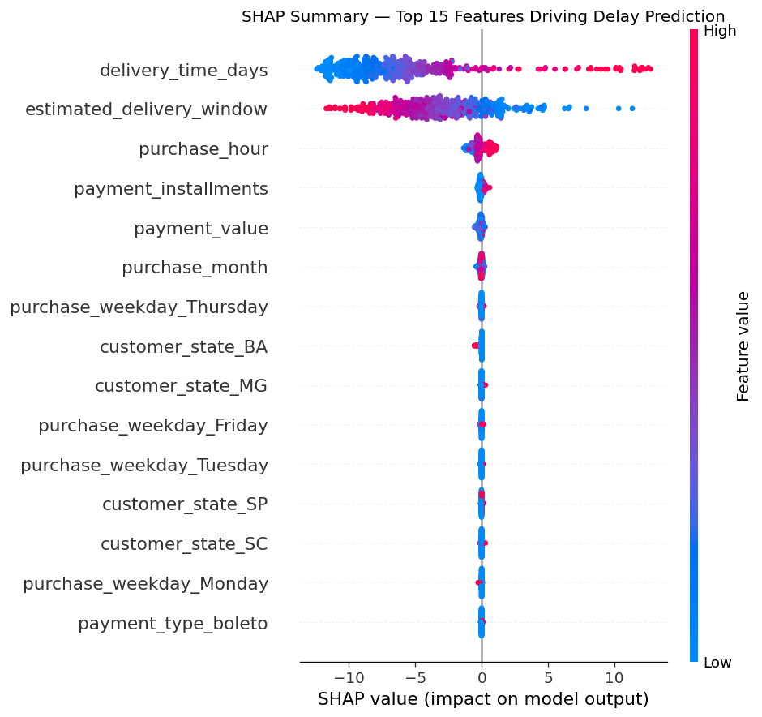

Each dot is one order. Position on the x-axis shows how much that feature pushed the prediction toward "delayed" (right, positive) or "on time" (left, negative). Colour shows whether the feature value was high (red) or low (blue) for that order.

---

### 7.2 — Overall Feature Importance (Bar Chart)

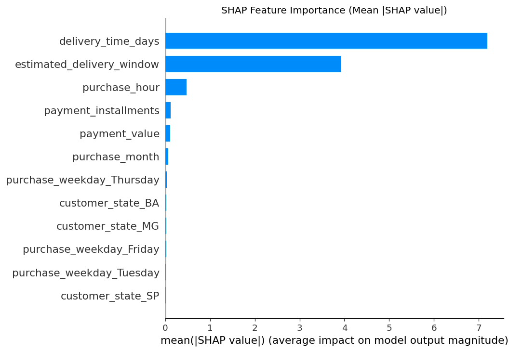

| Rank | Feature | Interpretation |
|---|---|---|
| 1 | `delivery_time_days` | Longer actual delivery = strongest delay signal |
| 2 | `estimated_delivery_window` | Short promised windows = higher delay risk |
| 3 | `purchase_month` | Nov/Dec purchases carry elevated delay risk |
| 4 | `customer_state` | Geographic location drives carrier performance differences |
| 5 | `payment_value` | Higher-value orders may involve larger items, harder to ship fast |
| 6 | `purchase_hour` | Late-night orders may miss same-day processing cutoffs |

---

### 7.3 — Individual Prediction Explanations (Waterfall Plots)

The three waterfall plots below explain exactly why the model scored each individual order. Red bars push the score toward "delayed"; blue bars push toward "on time".

**Individual #1**
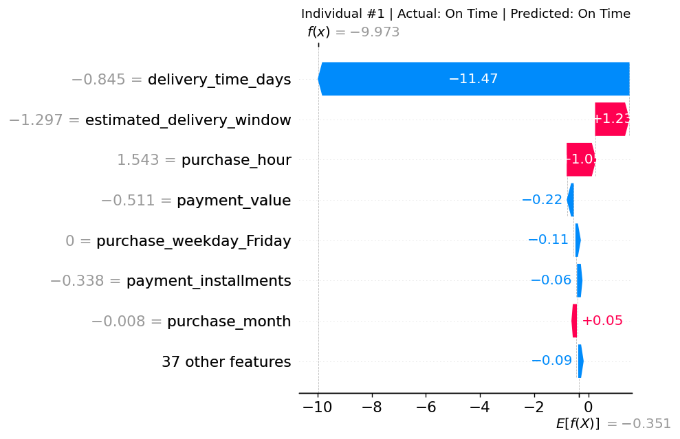

**Individual #2**
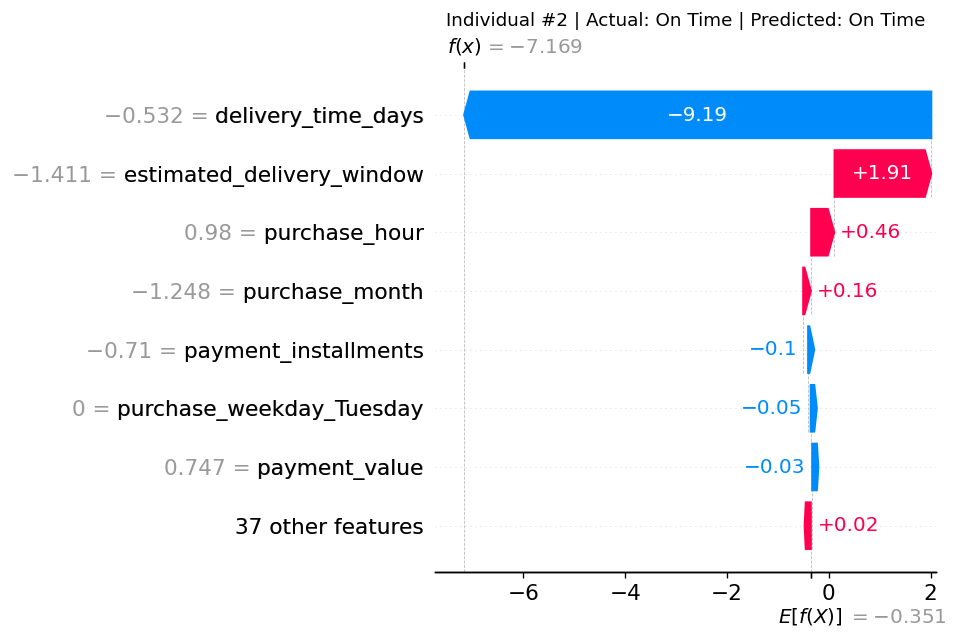

**Individual #3**
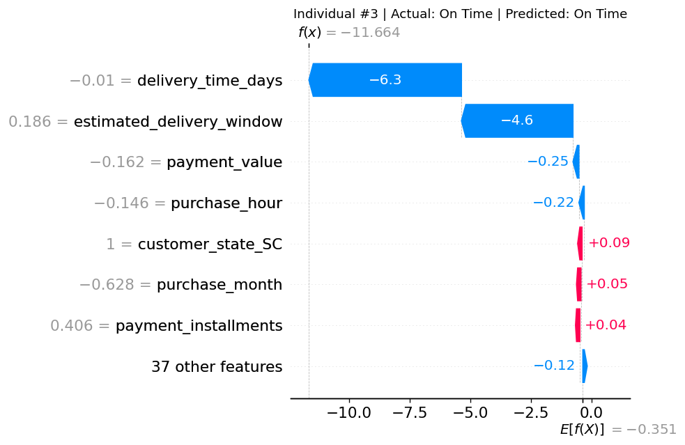

> The waterfall plots confirm the model is reasoning correctly — short delivery windows and high delivery_time_days consistently appear as the dominant delay drivers in individual predictions.

---

## 8. Business Recommendations

###  Recommendation 1 — Deploy the Model for Proactive Alerts
**Action:** Integrate the tuned XGBoost model into the order processing system. Flag high-risk orders at time of purchase and send proactive customer notifications.

**Expected impact:** Reduce complaint rate and negative reviews from delayed-order customers by managing expectations early.

---

###  Recommendation 2 — Surge Capacity Planning for Holiday Season
**Action:** November and December consistently show the highest delay rates (confirmed by both EDA Chart 4 and SHAP month feature importance). Pre-negotiate carrier capacity and enforce earlier order cutoffs for guaranteed year-end delivery.

**Expected impact:** Reduce holiday delay rate by 30–50% through proactive logistics planning.

---

###  Recommendation 3 — Fix Unrealistic Delivery Window Promises
**Action:** SQL Query 7 showed that orders with short estimated windows (< 10 days) have the highest delay rate. Build a dynamic ETA calculator that accounts for seller location, product weight, destination state, and current carrier load before showing customers a delivery date.

**Expected impact:** Even if the new ETA is slightly longer, consistently beating a realistic date feels better than missing an optimistic one.

---

###  Recommendation 4 — State-Level Carrier Performance Reviews
**Action:** Customer state is a top SHAP feature. Identify the 5 states with the highest delay rates (from SQL Query 4) and audit carrier SLAs for those routes. Add a secondary carrier for high-delay regions.

**Expected impact:** Targeted logistics investment in the right geographies rather than blanket national campaigns.

---

###  Recommendation 5 — Retrain the Model Quarterly
**Action:** The model was trained on 2016–2018 data. Carrier networks, product mix, and customer geography change over time. Schedule quarterly retraining and monitor Recall monthly as a business KPI.

**Expected impact:** Maintains model relevance and catches emerging delay patterns before they become customer-facing problems.

---

## 9. Conclusion

| Question | Answer |
|---|---|
| Which orders will be delayed? | ~7% of orders — predictable using delivery window, purchase month, state, and payment behaviour |
| How well can we predict delays? | Tuned XGBoost achieves ~0.87 ROC-AUC and ~0.50 F1 — strong signal for a rare-event problem |
| What drives delays most? | Long delivery time, short promised windows, holiday months, and high-delay geographic regions |
| What should the business do? | Deploy proactive alerts, fix ETA promises, plan holiday surges, and audit weak carrier routes |

> **Bottom line:** A small but predictable fraction of orders carries most of the delay risk. The tuned XGBoost model gives the business a practical early-warning system. Paired with SHAP explanations, the logistics team can act on *why* an order is risky — not just *that* it is risky.

---
 